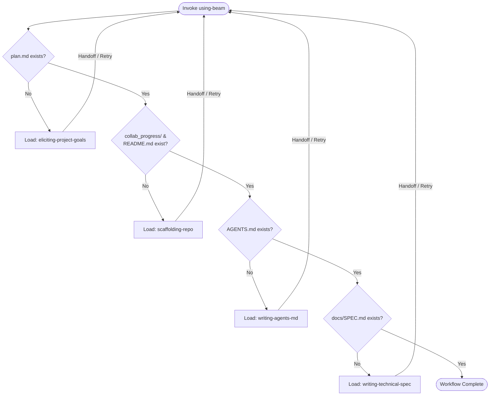

# Using Beam (The Orchestrator)

This skill is the Master Bootstrap Skill for the Beam harness workflow.
It acts as a state machine for repository initialization.

**You are the Conductor, not the Player.** Your job is not to write
`plan.md` or scaffold the repo yourself. Your job is to detect the
current phase, load the correct phase skill, keep the user informed,
and enforce gate transitions.

## 1. State Detection

Beam is resumable. On every invocation, detect the current phase by
checking for artifacts in this order:

1. `plan.md` — missing → **Phase 1** (`eliciting-project-goals`).
2. `collab_progress/` and `README.md` — either missing → **Phase 2**
   (`scaffolding-repo`).
3. `AGENTS.md` — missing → **Phase 3** (`writing-agents-md`).
4. `docs/SPEC.md` — missing → **Phase 4** (`writing-technical-spec`).

If all four artifacts exist, the workflow is complete.

## 2. Session Management & Visibility

At the start of orchestration — and on every resume — introduce (or
re-introduce) the workflow to the user.

**Visible checklist.** Post a markdown checklist of all four phases in
chat, with completed phases checked off based on State Detection.
Example:

> **Beam Repository Initialization**
> - [x] Phase 1: Goal Elicitation (`plan.md`)
> - [ ] Phase 2: Scaffolding (`collab_progress/` & `README.md`)
> - [ ] Phase 3: Guidelines (`AGENTS.md`)
> - [ ] Phase 4: Technical Spec (`docs/SPEC.md`)
>
> *Starting Phase 2...*

**Session todos.** Keep your internal todo list in sync: one entry for
the active phase, one per remaining phase. Update on every transition.

## 3. Phase Transitions

For each phase, in order:

1. **Load the instructions.** Use your `read` tool to read the target
   phase's `SKILL.md` into your context window.
2. **Execute to completion.** Run the loaded skill's pre-flight checks,
   steps, and rules exactly. Do not simulate the work. After its Output
   Checklist / `<HARD-GATE>` clears, return here and resume as the
   orchestrator — the orchestrator retains gate-verification
   responsibility.
3. **Verify the gate.** Do not declare the phase complete until the
   checklist is fully satisfied and every required artifact is on disk.
4. **Re-run detection.** Return to State Detection (section 1); the
   next missing artifact determines the next phase.

## Hard Rules

- **Do not simulate work.** Load and execute the child skill.
- **Do not batch phases.** One phase at a time; artifacts must be
  written to disk between phases.
- **Respect HARD-GATEs.** Phase 1 requires explicit user consent before
  `plan.md` is written. You cannot skip past that consent.

## Orchestrator Final Output Checklist

The Beam workflow is complete only when:

- [ ] `plan.md` exists and is populated.
- [ ] `collab_progress/` and `README.md` are scaffolded.
- [ ] `AGENTS.md` is accurately generated.
- [ ] `docs/SPEC.md` exists with all mandatory sections.
- [ ] The user has been notified that the project is ready for
      development.
